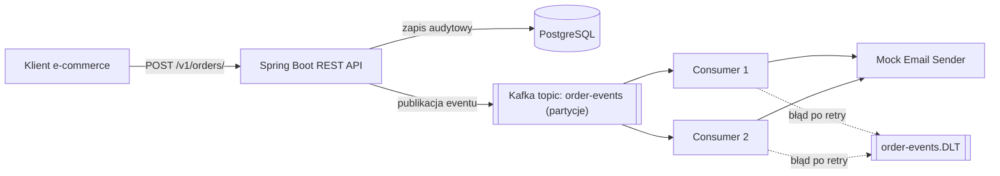

# Order Notification Service

Skalowalny web service przyjmujący duży wolumen żądań z danymi zamówień z różnych platform e-commerce i generujący (zasymulowane) powiadomienia e-mail o statusie przesyłki.

Zaprojektowany tak, aby pozostać responsywny pod dużym obciążeniem **bez rate limitera** — kontrola przepustowości wynika z architektury: Kafka jako bufor, skalowalni konsumenci, retry + dead-letter topic.

---

https://ecommerce1233211.onrender.com/

## Architektura



**Przepływ:**
1. Klient wysyła `POST /v1/orders/` z danymi zamówienia.
2. Żądanie jest **walidowane** i **natychmiast zapisywane** do PostgreSQL (audit log) — niezależnie od dalszego przetwarzania.
3. Event jest publikowany na Kafkę **asynchronicznie** (endpoint nie czeka na potwierdzenie) — API odpowiada `202 Accepted` bez blokowania.
4. Wielu **równoległych konsumentów** (skonfigurowanych przez `concurrency`, jeden na partycję) odbiera eventy i wywołuje zasymulowaną wysyłkę e-mail.
5. Jeśli przetwarzanie się nie powiedzie (np. błąd w mocku), Spring Kafka wykonuje retry, a po wyczerpaniu prób wiadomość trafia do **Dead Letter Topic** (`order-events.DLT`) zamiast być utracona.

### Dlaczego to jest skalowalne bez rate limitera

- **Kafka jako bufor** — przyjmowanie żądań (REST) jest odseparowane od ich przetwarzania (konsumenci). Skok ruchu na wejściu nie przeciąża bazy ani mechanizmu mailowego — po prostu rośnie kolejka do przetworzenia.
- **Partycje + concurrency** — liczba równoległych konsumentów jest kontrolowana przez liczbę partycji topicu i ustawienie `concurrency` w `@KafkaListener`. To jest mechanizm kontroli przepustowości wynikający z architektury, a nie z odrzucania żądań.
- **Klucz partycjonujący = `parcelNumber`** — kolejne aktualizacje statusu tego samego zamówienia trafiają zawsze do tej samej partycji, zachowując kolejność przetwarzania.
- **Retry + DLT** — błędy pojedynczych wiadomości nie blokują całej kolejki ani nie powodują utraty danych.

---

## Stack technologiczny

- **Java 17**, **Spring Boot 3**, **Spring Kafka**, **Spring Data JPA**
- **PostgreSQL** — audit log wszystkich żądań
- **Apache Kafka** — kolejkowanie i przetwarzanie asynchroniczne
- **Docker / Docker Compose** — środowisko lokalne
- **k6** — testy wydajnościowe

---

## Uruchomienie lokalne (Docker Compose)

Wymagania: zainstalowany [Docker](https://www.docker.com/products/docker-desktop/) i Docker Compose.

```bash
git clone https://github.com/Rwyszynski/Ecommerce
cd <folder-projektu>
docker compose up --build
```

To uruchomi trzy kontenery:
- `order-postgres` — PostgreSQL na porcie `5432`
- `order-kafka` — broker Kafki (KRaft mode) na porcie `9092`
- `order-app` — aplikacja Spring Boot na porcie `8080`

Po chwili appka będzie dostępna pod `http://localhost:8080`.

Zatrzymanie:
```bash
docker compose down
```

Zatrzymanie z usunięciem danych (baza, Kafka):
```bash
docker compose down -v
```

---

## Testowanie endpointów

### Wysłanie nowego zamówienia

```bash
curl -X POST http://localhost:8080/v1/orders/ \
  -H "Content-Type: application/json" \
  -d '{
    "parcelNumber": "PL123456789",
    "emailReceiver": "test@example.com",
    "receiverCountryCode": "PL",
    "senderCountryCode": "DE",
    "statusCode": 42
  }'
```

Oczekiwana odpowiedź: `202 Accepted`
```json
{ "message": "Order accepted" }
```

Po chwili w logach appki (`docker logs -f order-app`) powinny pojawić się:
```
Published order event for parcelNumber=PL123456789 to partition=...
Consumed order event for parcelNumber=PL123456789
[MOCK EMAIL] To: test@example.com | Parcel: PL123456789 | Status: 42 | Route: DE -> PL
```

### Weryfikacja zapisu w bazie (audit log)

```bash
docker exec -it order-postgres psql -U postgres -d postgres-chat -c "SELECT * FROM orders ORDER BY id DESC LIMIT 5;"
```

### Test mechanizmu retry / Dead Letter Topic

Wysłanie zamówienia z numerem zaczynającym się od `FAIL` symuluje błąd w mocku maila:

```bash
curl -X POST http://localhost:8080/v1/orders/ \
  -H "Content-Type: application/json" \
  -d '{
    "parcelNumber": "FAIL-001",
    "emailReceiver": "fail@example.com",
    "receiverCountryCode": "PL",
    "senderCountryCode": "DE",
    "statusCode": 55
  }'
```

Sprawdzenie, że wiadomość trafiła do DLT po wyczerpaniu prób retry:
```bash
docker exec -it order-kafka /opt/kafka/bin/kafka-console-consumer.sh \
  --bootstrap-server localhost:9092 \
  --topic order-events.DLT \
  --from-beginning
```

---

## Testy wydajnościowe (k6)

Skrypt testowy: [`k6/load-test.js`](./k6/load-test.js)

Scenariusz: narastające obciążenie od 0 do 300 wirtualnych użytkowników w ciągu ~3 minut, wysyłających losowe zamówienia.

### Uruchomienie testu lokalnie

```bash
docker run --rm -i -v "${PWD}/k6:/scripts" grafana/k6 run /scripts/load-test.js
```

> Jeśli appka działa w Docker Compose i testujesz z tego samego hosta na Windows/Mac, w skrypcie użyj `http://host.docker.internal:8080` zamiast `http://localhost:8080`.

### Wyniki (środowisko lokalne)

| Metryka | Wynik |
|---|---|
| Łączna liczba żądań | 169 925 |
| Throughput | ~843,7 req/s |
| p95 czasu odpowiedzi | 35,88 ms |
| p99 / max | 253,47 ms |
| Error rate | 0,04% (81 / 169 925) |
| Threshold `p(95)<1000ms` | ✅ PASS |
| Threshold `error rate<1%` | ✅ PASS |

Sporadyczne błędy (`i/o timeout`) wystąpiły wyłącznie w fazie gwałtownego opadania obciążenia pod koniec testu i wynikają z ograniczeń mostu sieciowego Docker Desktop na Windows (`host.docker.internal`), nie z architektury aplikacji.

Zweryfikowano również, że liczba wpisów w audit logu (`SELECT COUNT(*) FROM orders`) odpowiada liczbie przyjętych żądań — żadne dane nie zostały utracone pod obciążeniem.

### Nagranie testów

https://www.youtube.com/watch?v=mPm_OD_iwEI
---

## Wdrożenie produkcyjne

Aplikacja jest wdrożona na:

- **Aplikacja**: [Render](https://ecommerce1233211.onrender.com/https://ecommerce1233211.onrender.com/) — **TODO: adres URL**
- **Baza danych**: Aiven for PostgreSQL (darmowy tier)
- **Kafka**: Aiven for Apache Kafka (darmowy tier)

### Test działającej usługi

```bash
curl -X POST https://<adres-render>.onrender.com/v1/orders/ \
  -H "Content-Type: application/json" \
  -d '{
    "parcelNumber": "PL999000111",
    "emailReceiver": "demo@example.com",
    "receiverCountryCode": "PL",
    "senderCountryCode": "FR",
    "statusCode": 10
  }'
```

Oczekiwana odpowiedź: `202 Accepted`.

### Ograniczenia darmowego środowiska (ważne przy weryfikacji)

- **Render (free tier)**: aplikacja może "zasnąć" po dłuższym braku ruchu — pierwsze żądanie po przerwie może potrwać do ~30-60s (cold start).
- **Aiven Kafka (free tier)**: usługa wyłącza się automatycznie po 24h bez ruchu produkcyjnego/konsumenckiego — jeśli test nie przechodzi, może być potrzebna ręczna reaktywacja z panelu Aiven (zwykle kilka minut).
- Z tego powodu topic `order-events` na produkcji ma **2 partycje** (limit darmowego tieru Aiven), a nie 3 jak w środowisku lokalnym — `concurrency` konsumenta jest odpowiednio dostosowana.

---

## Struktura projektu

```
src/main/java/com/example/demo/
├── controller/       # REST API
├── dto/               # DTO żądań/odpowiedzi HTTP
├── entity/            # Encje JPA (audit log)
├── event/              # Kształt danych publikowanych na Kafkę
├── kafka/              # Producent, konsument, konfiguracja topiców
├── mail/               # Mock wysyłki e-mail
├── repository/         # Spring Data JPA
└── service/            # Logika biznesowa

k6/                     # Skrypty testów wydajnościowych
docker-compose.yml       # Środowisko lokalne (appka + Kafka + Postgres)
Dockerfile
```

---

## Kluczowe decyzje projektowe

- **Audit log jako append-only tabela** — każde żądanie (w tym każda aktualizacja statusu tego samego zamówienia) jest osobnym wpisem, zgodnie z wymaganiem logowania wszystkich żądań.
- **Zapis do bazy i publikacja na Kafkę nie są w jednej transakcji rozproszonej** — audit log zapisuje się zawsze; jeśli publikacja na Kafkę się nie powiedzie, zostaje to zalogowane. Pełne rozwiązanie tego przypadku brzegowego (transactional outbox pattern) to świadomie przyjęty kierunek dalszego rozwoju, poza zakresem tego zadania.
- **Brak rate limitera na wejściu** — zgodnie z wymogiem zadania, kontrola przepływu wynika wyłącznie z architektury kolejkowania (partycje, concurrency, backpressure Kafki).
